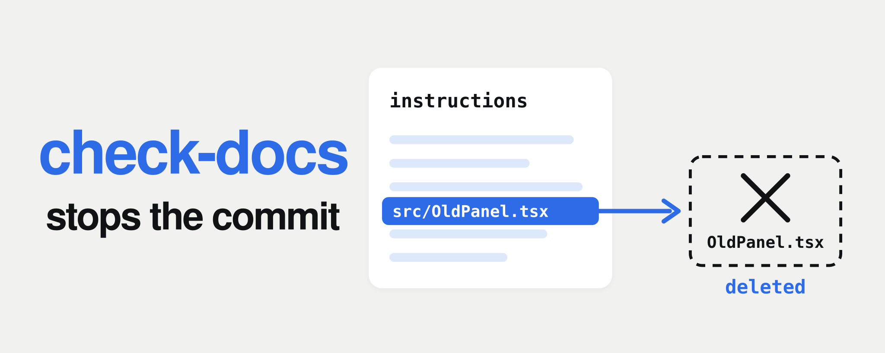
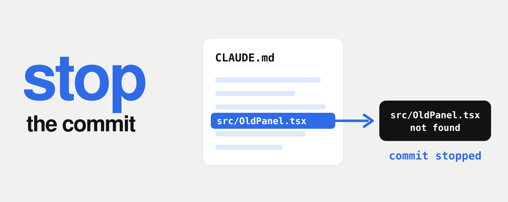

<p align="center">
  
</p>

<h3 align="center">A small shell script that stops a commit<br>when CLAUDE.md or AGENTS.md names a deleted file.</h3>

<p align="center">
  Plain <code>sh</code> · standard Unix tools<br>
  For projects that use CLAUDE.md or AGENTS.md
</p>

<p align="center">
  Made by Pavel Rabtsevich · <a href="https://x.com/p_rabtsevich"><b>@p_rabtsevich</b></a> on X
</p>

<p align="center">
  <a href="https://github.com/ipaulsmith/check-docs/actions/workflows/test.yml"></a>
</p>

<p align="center">
  <a href="#install">Install</a> ·
  <a href="#what-happens-when-it-catches-something">Example</a> ·
  <a href="#what-it-checks">What it checks</a> ·
  <a href="#limitations">Limitations</a>
</p>

## Why this exists

CLAUDE.md and AGENTS.md are the files your coding agent reads before it works in your repo. They tell it where things live and how to run them.

When you delete or move a file, the build and the tests catch the code that still uses it. Nothing shows you the line in CLAUDE.md that still points to it. The agent keeps reading that line and does what it says.

`check-docs` covers the mechanical part of that gap. Before every commit it reads your CLAUDE.md and AGENTS.md files, follows their `@` imports, looks for paths and names that no longer exist, and stops the commit until you fix the line.

## Install

Open Claude Code, Codex or Cursor in your repo and paste this whole block into the chat. The agent saves the script, adds it to the pre-commit setup you already have without overwriting anything, and runs it once.

```text
Save the script at the end of this message as check-docs.sh in the repo root.
Add `sh check-docs.sh` to the repo's existing pre-commit setup.
If the repo already uses Husky, pre-commit, core.hooksPath or another hook setup,
use that instead of creating a competing hook.
Otherwise use .git/hooks/pre-commit and make it executable.
Keep everything that is already there. Do not overwrite or remove anything.
Run sh check-docs.sh once now.
If it fails, show me the stale line before changing anything.

check-docs.sh:
#!/bin/sh
# Exit 1: an instruction file names a missing path, a missing @import or a deleted name.
# Exit 2: the check itself could not run.
# Plain sh; tested on macOS and Ubuntu.
set -f
export LC_ALL=C
for t in grep sed tr sort awk; do
  command -v "$t" >/dev/null || { echo "need $t"; exit 2; }
done
nl='
'
G=; git rev-parse --git-dir >/dev/null 2>&1 && G=1

# in git: present means in the index; outside git: present on disk
present() {
  if [ -n "$G" ]; then git --literal-pathspecs ls-files --error-unmatch -- "$1" >/dev/null 2>&1
  else [ -e "$1" ]; fi
}
# a/./b/../c -> a/c ; keeps leading ../ so paths outside the repo stay visible
norm() {
  printf '%s\n' "$1" | awk -F/ '{ n = 0
    for (i = 1; i <= NF; i++) {
      if ($i == "" || $i == ".") continue
      if ($i == ".." && n > 0 && s[n] != "..") { n--; continue }
      s[++n] = $i }
    o = "."; for (i = 1; i <= n; i++) o = (i == 1 ? s[i] : o "/" s[i]); print o }'
}
# @imports the way Claude Code reads them: not in code spans or code blocks,
# @ after space, tab or NBSP, first character [A-Za-z0-9._-] or ~/ or /, "\ " is a space, #anchor dropped
imports() {
  awk 'BEGIN { blank = 1 }
  function nocode(s,   out, n, rest, tmp, pos, j) {
    out = ""
    while (match(s, /`+/)) {
      out = out substr(s, 1, RSTART - 1); n = RLENGTH; rest = substr(s, RSTART + n)
      tmp = rest; pos = 0; j = 0
      while (match(tmp, /`+/)) {
        if (RLENGTH == n) { j = pos + RSTART; break }
        pos += RSTART + RLENGTH - 1; tmp = substr(tmp, RSTART + RLENGTH) }
      if (j) { out = out " "; s = substr(rest, j + n) } else { out = out substr(s, RSTART, n); s = rest }
    }
    return out s
  }
  { sub(/\r$/, ""); q = $0
    while (q ~ /^ ? ? ?>/) sub(/^ ? ? ?> ?/, "", q)
    if (fc != "") {
      if (match(q, /^ ? ? ?(`+|~+)[ \t]*$/)) { r = substr(q, RSTART, RLENGTH); gsub(/[ \t]/, "", r)
        if (substr(r, 1, 1) == fc && length(r) >= fl) fc = "" }
      next }
    if (match(q, /^ ? ? ?(```+|~~~+)/)) { r = substr(q, RSTART, RLENGTH); gsub(/ /, "", r)
      if (!(substr(r, 1, 1) == "`" && index(substr(q, RSTART + RLENGTH), "`"))) {
        fc = substr(r, 1, 1); fl = length(r); ic = 0; next } }
    if (q ~ /^[ \t]*$/) { blank = 1; next }
    ind = (q ~ /^(    |\t)/)
    if (ind && !inlist && (blank || ic || !para)) { ic = 1; blank = 0; next }
    if (q ~ /^ ? ? ?([-+*]|[0-9]+[.)])([ \t]|$)/) inlist = 1
    else if (!ind && blank) inlist = 0
    ic = 0; blank = 0; para = (q !~ /^ ? ? ?#/)
    s = " " nocode(q); gsub(/\302\240/, " ", s)
    while (match(s, /[ \t]@([^ \t\\]|\\ )+/)) {
      t = substr(s, RSTART + 2, RLENGTH - 2); s = substr(s, RSTART + RLENGTH)
      if (t !~ /^([A-Za-z0-9._-]|~\/|\/)/) continue
      sub(/#.*/, "", t); gsub(/\\ /, " ", t); if (t != "") print t }
  }' "$1"
}

# 1. instruction files: root, .claude/, and nested ones
roots=$({
  for f in CLAUDE.md .claude/CLAUDE.md CLAUDE.local.md AGENTS.md .claude/AGENTS.md; do echo "$f"; done
  if [ -n "$G" ]; then git -c core.quotepath=off ls-files -co --exclude-standard
  else find . \( -name .git -o -name node_modules \) -prune -o \( -type f -o -type l \) -print | sed 's#^\./##'
  fi | grep -E '(^|/)(CLAUDE\.md|CLAUDE\.local\.md|AGENTS\.md)$'
} | awk '!seen[$0]++')
files=; queue=; bad=; targets=
IFS=$nl
for f in $roots; do [ -f "$f" ] && queue="$queue$f 0$nl"; done

# 2. follow @imports breadth-first, at most four hops, each file once
seen="$nl"
while [ -n "$queue" ]; do
  item=${queue%%"$nl"*}; queue=${queue#*"$nl"}
  f=${item% *}; depth=${item##* }
  case $seen in *"$nl$f$nl"*) continue ;; esac
  seen="$seen$f$nl"; files="$files$f$nl"
  [ "$depth" -lt 4 ] || continue
  imps=$(imports "$f") || exit 2
  d=${f%/*}; [ "$d" = "$f" ] && d=.
  for t in $imps; do
    case $t in /*|'~'*) continue ;; esac      # absolute and home imports: machine-specific, not checked
    r=$(norm "$d/$t")
    case $r in ..|../*) continue ;; esac      # outside the repo: not checked
    { [ -f "$r" ] || { [ ! -e "$r" ] && present "$r"; }; } && targets="$targets$r$nl"
    if present "$r" && [ -f "$r" ]; then queue="$queue$r $((depth + 1))$nl"
    else bad="$bad$f: @$t not found$nl"; fi
  done
done
unset IFS

# in a git repo, require instruction-file edits (and deletions) to be staged before checking
if [ -n "$G" ]; then
  set --; IFS=$nl; for f in $roots$nl$files$targets; do [ -n "$f" ] && set -- "$@" "$f"; done; unset IFS
  unstaged=$(git --literal-pathspecs diff --name-only -- "$@" deleted-names.txt) || exit 2
  [ -z "$unstaged" ] || { echo "stage your instruction file edits first:"; printf '%s\n' "$unstaged"; exit 2; }
fi
[ -n "$files" ] || { echo "no CLAUDE.md or AGENTS.md here"; exit 0; }

# 3. every backticked word with a slash must exist as a path (in git: in the index)
wordsof() {
  spans=$(grep -ohE '`[^`]+`' "$1"); [ $? -le 1 ] || exit 2
  printf '%s\n' "$spans" | tr -d '`' | tr ' \t' '\n\n' |
    grep '/' | grep -v -e '://' -e '[*:#<>$]' -e '^[~-]' | sort -u
}
top=
IFS=$nl
for f in $files; do
  d=${f%/*}; [ "$d" = "$f" ] && d=.
  words=$(wordsof "$f") || exit 2
  if [ "$d" = . ]; then top="$top$words$nl"; continue; fi
  for p in $words; do present "$p" || present "$(norm "$d/$p")" || bad="$bad$f: $p not found$nl"; done
done
topmiss=$(for p in $(printf '%s' "$top" | sort -u); do present "$p" || printf '%s not found\n' "$p"; done)
unset IFS
missing=$(printf '%s\n%s' "$topmiss" "$bad" | sed '/^$/d')
[ -z "$missing" ] || { printf '%s\n' "$missing"; exit 1; }

# 4. no name from deleted-names.txt (optional, one per line) may appear
if [ -e deleted-names.txt ]; then
  [ -f deleted-names.txt ] || { echo "deleted-names.txt: not a file"; exit 2; }
  names=$(sed 's/^[[:space:]]*//;s/[[:space:]]*$//;/^$/d' < deleted-names.txt) || exit 2
  if [ -n "$names" ]; then
    set --; IFS=$nl; for f in $files; do set -- "$@" "$f"; done; unset IFS
    hits=$(printf '%s\n' "$names" | grep -nwFf - "$@")
    [ $? -le 1 ] || exit 2
    [ -z "$hits" ] || { printf '%s\n' "$hits"; echo "Deleted name found"; exit 1; }
  fi
fi
echo "docs ok"
```

Or by hand:

```sh
curl -fsSL https://raw.githubusercontent.com/ipaulsmith/check-docs/main/check-docs.sh -o check-docs.sh
sh check-docs.sh
```

Then add `sh check-docs.sh` to your pre-commit hook. If the repo already uses Husky, the pre-commit framework or `core.hooksPath`, add the line there instead of creating a second hook. A new `.git/hooks/pre-commit` needs `#!/bin/sh` as its first line and `chmod +x`.

The check has to run on every commit, whatever files it touches. With the pre-commit framework set `always_run: true` and `pass_filenames: false` on the hook. Otherwise a commit that only deletes files can skip it.

## What happens when it catches something

<p align="center">
  
</p>

Four commits in a test repo with the script installed as a pre-commit hook. The script output is copied as it printed. The `→` lines are notes.

```text
$ git commit -m "delete panel"          # CLAUDE.md still names src/OldPanel.tsx
src/OldPanel.tsx not found
→ commit stopped

$ git commit -m "fix path"              # OldPanel is in deleted-names.txt
3:Use `OldPanel` for settings.
Deleted name found
→ commit stopped

$ git commit -m "fix name"              # edited CLAUDE.md, forgot git add
stage your instruction file edits first:
CLAUDE.md
→ commit stopped

$ git add CLAUDE.md && git commit -m "fix name"
docs ok
→ committed
```

## What it checks

It reads these instruction files, starting from the folder it runs from. As a git hook that is the repo root.

- `CLAUDE.md`, `.claude/CLAUDE.md`, `CLAUDE.local.md`, `AGENTS.md` and `.claude/AGENTS.md` at the root.
- `CLAUDE.md`, `CLAUDE.local.md` and `AGENTS.md` in subfolders.
- Every file those files import with `@path`, up to four hops deep.

- **Paths.** Every word with a slash that you wrote in backticks, like `src/OldPanel.tsx`, must exist. In a git repo it must be in the index, so it is part of what you commit. Outside git it must exist on disk.
- **Imports.** Every `@path` import must point to a file that exists, in the index inside git or on disk outside it.
- **Deleted names.** If you keep a `deleted-names.txt` with one name per line, none of those names may appear in any of these files as a whole word.
- **Unstaged edits.** In a git repo it first makes sure your latest edits to these files and `deleted-names.txt` are staged, so it checks the same version of these files that you commit. The files themselves are always read from disk, so an untracked CLAUDE.md or `deleted-names.txt` is checked too, even though it is not in the commit.

| Exit | Prints | Commit |
|:---:|---|---|
| `0` | `docs ok`, or `no CLAUDE.md or AGENTS.md here` | goes through |
| `1` | the missing path or import, or the line with a deleted name | stopped |
| `2` | why the check could not run, or that your edits to these files are not staged | stopped |

These are the script's exit codes. `git commit` itself exits 1 whenever the hook fails.

## How it works

- It needs `sh`, `grep`, `sed`, `tr`, `sort` and `awk`. If one is missing it says so and exits 2. Git is optional: outside a git repo the staged-files check is skipped and paths are checked on disk.
- Paths are taken from every backticked span, split on spaces. A word counts as a path when it has a slash. Words are skipped when they contain `://`, `*`, `:`, `#`, `<`, `>` or `$`, or start with `~` or `-`. That leaves out URLs, globs, `file:line` references, anchors and flags.
- In a git repo a path counts as present when `git ls-files` finds it in the index, as a file or as a folder with tracked files. A file that exists on disk but was never added with `git add`, or was removed with `git rm --cached`, counts as missing. Pathspecs are literal, so `app/[slug]/page.tsx` is not a glob.
- Each missing path is printed once. For files at the root it prints `<path> not found`. For files in a subfolder it prints `<file>: <path> not found`, and a path counts as present if it exists either from the repo root or from that file's folder. If any path or import is missing, the deleted-names check does not run on that commit.
- Imports are read the way Claude Code reads them. An import is `@` at the start of a line or after a space, tab or non-breaking space, and it runs to the next space or tab. The first character after `@` must be a letter, digit, `.`, `_` or `-`, or the import starts with `~/` or `/`. `\ ` stands for a space and a `#anchor` at the end is dropped. Nothing else is trimmed, so in `see @README.md.` the dot is part of the path, as it is for Claude Code.
- `@path` is resolved from the folder of the file that contains it. Imports inside code spans (any number of backticks) and code blocks (fenced or indented) are ignored. Indented lines inside a list are list content, not code, so imports there are checked. Up to four hops are followed, each file is read once, and import cycles stop there. A missing import prints `<file>: @<path> not found`. Absolute imports, `@~/` home imports and imports that resolve outside the repo are machine-specific and are not checked.
- Subfolder instruction files are found with `git ls-files`, so tracked and untracked files count and gitignored ones do not. The root `CLAUDE.local.md` is always read, even when it is gitignored, so its imports have to point at tracked files. Outside git it uses `find` and skips `.git` and `node_modules`. Other Markdown files are only read when an instruction file imports them.
- Every AGENTS.md is checked, also in folders that have a CLAUDE.md, where Claude Code would skip it, because other agents read it.
- `deleted-names.txt` is optional. Leading and trailing spaces are trimmed, blank lines are ignored, and matching is whole-word and case-sensitive. Each hit is printed with its line number, then `Deleted name found`. When more than one instruction file is read, the file name is printed too. If `deleted-names.txt` exists but is not a regular file, the check exits 2. A `deleted-names.txt` symlink that points nowhere counts as no list. Whole-word matching is byte-based, so word boundaries are not detected inside non-Latin names.
- The staged-files check uses `git diff`. Any unstaged change or deletion of an instruction file, an imported file or `deleted-names.txt` stops the commit with `stage your instruction file edits first:` and the list of files, so you cannot commit one version of these files while the check looked at another.

## Limitations

- It is a text match, not a Markdown parser. It only checks words with a slash inside single backticks on a line. Fenced code blocks are not treated as code: plain lines inside a fence are not checked, but a single-backtick span inside a fence is. Paths in plain prose are not checked.
- Any backticked word with a slash counts as a path. `origin/main`, branch names like `feature/foo`, API routes like `/api/users`, scoped packages like `@tanstack/react-query` and `owner/repo` names all show up as missing. Drop the backticks around them, or skip the check once with `git commit --no-verify`.
- Not checked: Markdown links like `[setup](docs/setup.md)`, file names without a slash like `Makefile`, `.claude/rules/`, gitignored instruction files in subfolders, and other tools' files such as `.cursor/rules`. Deleted names are not collected automatically, see [#3](https://github.com/ipaulsmith/check-docs/issues/3).
- Any `@word` after whitespace and outside code is an import for Claude Code, so a handle like `@alice` or a package like `@tanstack/react-query` written in plain text is reported as a missing import. Put it in backticks to keep it literal.
- It is not a full Markdown parser. A code span that runs across two lines is not recognised, list and code-block boundaries are approximated line by line, and HTML comments are read as text.
- Inside a git repo, paths are checked against the git index, not the working tree. Untracked or ignored files such as `dist/` or `.venv/bin/python`, absolute paths like `/usr/bin/env`, paths outside the repo such as `../other/`, and paths inside a submodule or through a symlinked folder are reported as missing. If you reference one of these on purpose, remove the backticks or skip the hook for that commit with `git commit --no-verify`.
- Paths with spaces are not supported.
- It runs on the folder it starts in. Run from a subfolder by hand and it reports that there is nothing to check.
- A stray single backtick shifts the pairing, so a path after it can be missed. Punctuation glued to a path inside the backticks, like `` `src/a.ts,` ``, becomes part of the path and shows up as missing.
- Outside git on macOS, letter case is ignored, so `src/oldpanel.tsx` passes when the file is `OldPanel.tsx`. Inside git the index lookup is case-exact.
- Tested on macOS and Ubuntu on every push, under `dash`, `bash` and each system's own `/bin/sh`. It uses `grep -o`, `-h` and `-w`, which are not in POSIX but are in GNU and BSD grep. Windows is not supported. Git Bash and WSL have not been tested.

## Tests

```sh
python3 tests/run-cases.py check-docs.sh
sh tests/git-cases.sh "$PWD/check-docs.sh"
```

Both exit non-zero if any case fails. CI runs them on macOS and Ubuntu on every push, under `dash`, `bash` and each system's own `/bin/sh`.

- `run-cases.py` builds 106 cases in temp folders, including nested instruction files, `@` imports, import chains and cycles, unreadable files, missing tools, CRLF line endings and non-ASCII paths, and checks exit codes and output. Set `SH=/bin/dash` or `SH=/bin/bash` to use another shell. Run it as a normal user, not root.
- `git-cases.sh` runs 24 scenarios in real git repos with the script installed as a pre-commit hook, including `git commit -a` and a commit from a subfolder. For each one it checks the script's exit code, its output and whether the commit was made. Pass a shell as the second argument to use another one.

## License

MIT. Bug reports go to [issues](https://github.com/ipaulsmith/check-docs/issues) or [@p_rabtsevich](https://x.com/p_rabtsevich) on X.
